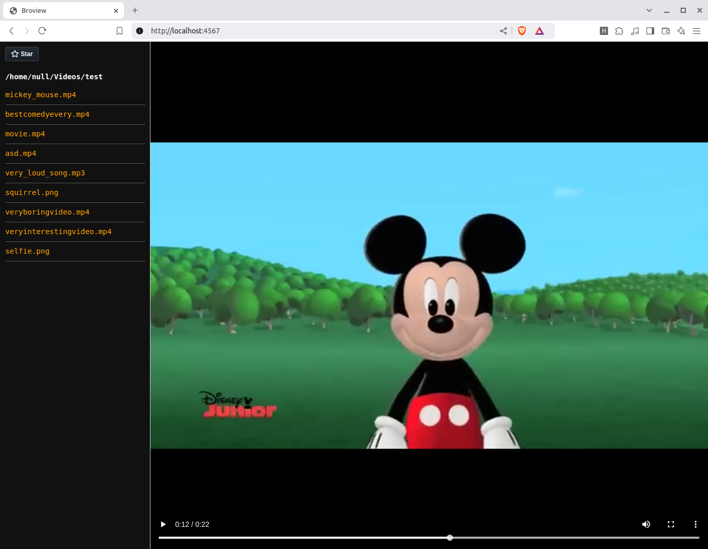

# Broview - Browser-based media viewer

**Broview** is simple browser-based media viewer that uses FFMmpeg to adjust volume for local video and audio files.
You can easily write your own functionality and style for the viewer with some basic webdev knowledge.
This application is for those who:
- Are tired of inconsistent audio levels blasting their ears.
- Want a customizable media player.
- Need quick and easy way to share media files via a reverse proxy or local network
- Prefer watching videos directly in the browser.



---

## Prerequisities
- [FFmpeg](https://ffmpeg.org/)
  
- Ruby (version >= 3.3.0)

- Linux distro or macOS (currently only tested on Linux)

---

## Setup
1. Install prerequisites
```
# Linux (Debian/Ubuntu)
sudo apt install ffmpeg

# macOS (using Homebrew)
brew install ffmpeg

# Ensure following cli tools are available on your system:
lsof
awk
xargs
```

2. Clone the repository
```
git clone https://github.com/otthe/broview.git
cd broview
```

3. Install Ruby dependencies
```
gem install bundler
bundle install
```

4. Configure Broview
```
nano config/config.yml
```

5. Make script executable and run it from the directory where your media files are located
```
chmod +x bin/broview
./bin/broview     #-o or --options for list of arguments

# add it to PATH for easier access
export PATH=$PATH:/path/to/broview/bin
```
Whenever you run __./broview__, new browser tab should popup with the media files from the same directory you ran Broview on the cli.
<br><b>Please note that if the directory contains large amounts of media files, it might take some time for the server to launch on the first time.</b>
<b>This is due to Ffmpeg processing the audio and caching the volume levels.</b>

---
## Customization

If you want customize the style or functionality of the editor, just make new '.erb' -file into the '/themes' folder and make 'config/config.yml' point to it.
You can look for example from the '/themes/default.erb'. If you want to add system features, you have to add them to existing or new routes that are located on '/lib/broview/server.rb'.

---
## Things to consider

- If your folder contains very large amounts of media files there might be some initial performance issues as ffmpeg takes some time to process the videos.
- The program has only been tested on my Ubuntu machine. On macOS there might be chance that the xargs order might vary and cause some errors.